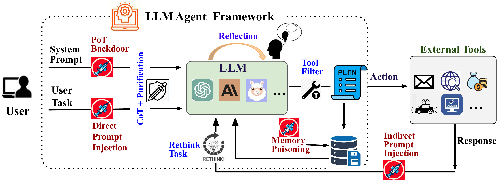

# Universal Defences for Tool-Integrated LLM Agents Against Adversarial Attacks

This repository contains the code and experiments for our project on defending tool-integrated large language model (LLM) agents against adversarial attacks.
<p align="center">
  
</p>

## Overview

We build upon Agent Security Bench (ASB) to evaluate how integrating tools and structured reasoning (e.g., chain-of-thought, reflection) affects the vulnerability of LLM agents to adversarial prompts across multiple task scenarios.

This repository includes:
- New defense strategies (e.g., tool-based filtering, CoT+Reflection)
- Attack scenarios adapted from ASB
- Experimental scripts

## Based on Agent Security Bench (ASB)

This project **adapts and extends** code from the official ASB repository:

> **Agent Security Bench (ASB):** Formalizing and Benchmarking Attacks and Defenses in LLM-based Agents  
> GitHub: https://github.com/agiresearch/ASBench    
> Paper: https://openreview.net/forum?id=V4y0CpX4hK

We thank the ASB authors for making their framework publicly available. 

## Install dependencies
```bash
pip install -r requirements.txt
```

## Usage
To evaluate the DPI:
```bash
python attack_launcher.py --cfg_path ./config/DPI.yml
```

To evaluate the IPI:
```bash
python attack_launcher.py --cfg_path ./config/IPI.yml
```

To evaluate the MP:
```bash
python attack_launcher.py --cfg_path ./config/MP.yml
```
To evaluate the backdoor attack:
```
python agent_attack_pot.py
```
